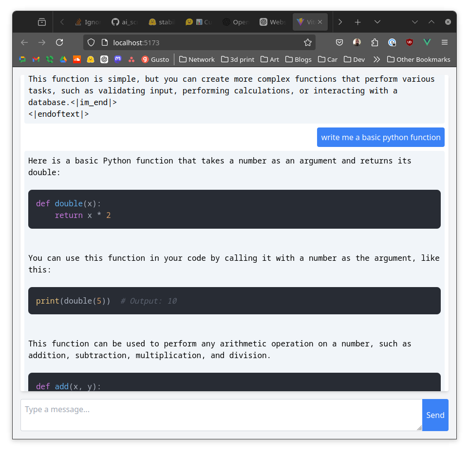
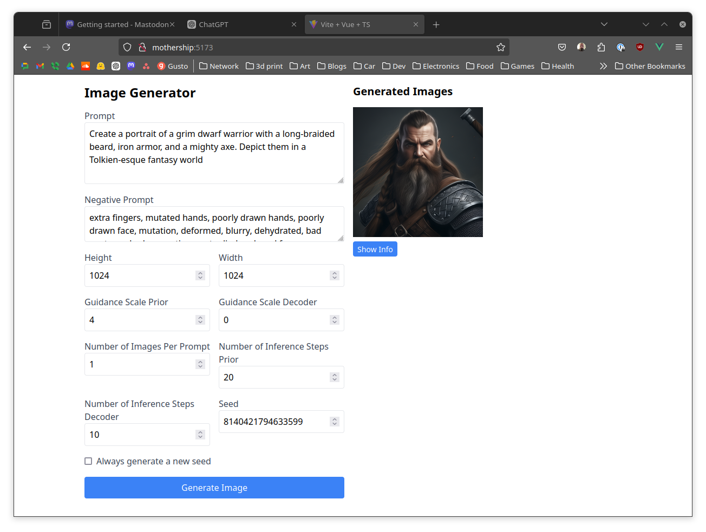

# AI Scripts

NOTE: An RTX video card is likely needed with support for CUDA 12.5   
This repo is using docker to pull an image from Nvidia for pytorch support

[https://docs.nvidia.com/deeplearning/frameworks/pytorch-release-notes/rel-24-06.html](https://docs.nvidia.com/deeplearning/frameworks/pytorch-release-notes/rel-24-06.html)

> ## Driver Requirements
> Release 24.06 is based on NVIDIA CUDA 12.5.0.23, which requires NVIDIA Driver release 545 or later. However, if you are running on a data center GPU (for example, T4 or any other data center GPU), you can use NVIDIA driver release 470.57 (or later R470), 525.85 (or later R525), 535.86 (or later R535), or 545.23 (or later R545).
> 
> The CUDA driver’s compatibility package only supports particular drivers. Thus, users should upgrade from all R418, R440, R450, R460, R510, and R520 drivers, which are
> not forward-compatible with CUDA 12.3. For a complete list of supported drivers, see the CUDA Application Compatibility topic. For more information, see CUDA Compatibility and Upgrades. 

## Running
* `git clone https://github.com/joshchernoff/ai_scripts.git`

* `cd ai_scripts`

You may need to setup your auth key for hugging face
* `[ ! -f .env ] && touch .env; echo 'HUGGINGFACE_TOKEN="your_key"' >> .env` 

* `docker compose up`

In another term
* `docker compose exec pytorch /bin/bash`

* `pip install diffusers transformers accelerate peft`

* `python sdxl-turbo-text-to-image.py`

### Vue/Flask apps
These are WIP

#### Code helper

Start flask
* `cd code_helper`
* `python app.py`

Start vue
* `cd code_helper/code-chat-app`
* `npm run dev`

#### Cascade helper

Start flask
* `cd cascade_helper`
* `python app.py`

Start vue
* `cd cascade_helper/cascase-image-generator`
* `npm run dev`
